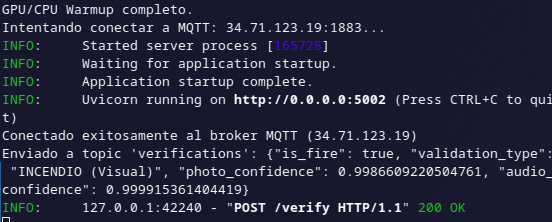
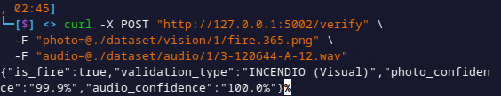
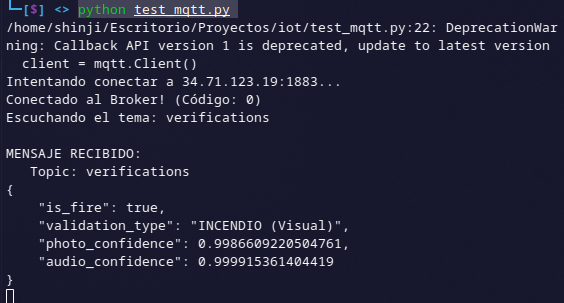

# AI-Server

Servidor de Inteligencia Artificial basado en arquitectura DDD (Domain-Driven Design) para la deteccion de incendios mediante analisis de audio e imagenes. El sistema procesa archivos, valida el incidente con modelos de Deep Learning y publica los resultados en un broker MQTT.

## 1. Arquitectura del Proyecto

El proyecto sigue una estructura modular donde el dominio (reglas de negocio) esta aislado de la infraestructura (AI, MQTT, Web).

```text
ai-server/
├── src/
│   ├── application/           # Logica de orquestacion
│   ├── domain/                # Reglas de negocio y entidades
│   ├── infrastructure/        # Adaptadores (MQTT, AI, Config)
│   └── interfaces/            # API Web (FastAPI)
├── main.py                    # Punto de entrada
├── data/                      # Modelos .h5 y logs
└── dataset/                   # Datos de entrada
```

---

## 2. Instalacion y Entorno

Sigue estos pasos en tu terminal para preparar el entorno de ejecucion.

### 2.1 Crear el entorno

```bash
conda create -n fuego_gpu python=3.10 -y
```

### 2.2 Activar el entorno

```bash
conda activate fuego_gpu
```

### 2.3 Instalar librerias del sistema

Necesario para procesar audio (libsndfile).

```bash
conda install -c conda-forge ffmpeg libsndfile -y
```

### 2.4 Instalar TensorFlow (GPU) y Ciencia de Datos

```bash
pip install "tensorflow[and-cuda]" numpy pandas scikit-learn matplotlib
```

### 2.5 Instalar librerias de Audio

```bash
pip install librosa kaggle resampy
```

### 2.6 Instalar dependencias del servidor

```bash
pip install fastapi uvicorn python-multipart paho-mqtt pydantic-settings
```

---

## 3. Configuracion

El servidor esta configurado para conectarse a la siguiente infraestructura:

- **Broker MQTT Host:** 34.71.123.19
- **Broker MQTT Port:** 1883
- **Topic:** verifications
- **Transporte:** TCP
- **Modelos IA:** Carga automatica desde `data/checkpoints/`

---

## 4. Ejecucion y Pruebas

### Paso 1: Levantar el Monitor MQTT (Opcional)

Ejecuta el script de prueba para escuchar los eventos en tiempo real.

```bash
python test_mqtt.py
```

**Salida esperada en consola:**

```text
Escuchando MQTT en 34.71.123.19:1883...
Conectado al Broker! (Codigo: 0)
Escuchando el tema: verifications
```

### Paso 2: Iniciar el Servidor AI

En una nueva terminal, inicia la aplicacion.

```bash
python main.py
```

**Salida esperada en consola:**

```text
Inicializando dependencias del sistema...
Inicializando Adaptador Keras...
GPU/CPU Warmup completo.
Intentando conectar a MQTT: 34.71.123.19:1883...
Conectado exitosamente al broker MQTT (34.71.123.19)
Uvicorn running on http://0.0.0.0:5002
```

### Paso 3: Realizar una peticion (Cliente)

Envia una imagen y un audio para su analisis.

```bash
curl -X POST "http://127.0.0.1:5002/verify" \
  -F "photo=@./dataset/vision/1/fire.365.png" \
  -F "audio=@./dataset/audio/1/3-120644-A-12.wav"

```

### Paso 4: Resultados

**Respuesta JSON del Servidor:**

```json
{
  "is_fire": true,
  "validation_type": "INCENDIO (Visual)",
  "photo_confidence": "99.9%",
  "audio_confidence": "100.0%"
}
```

**Log recibido en Monitor MQTT:**

```text
MENSAJE RECIBIDO:
   Topic: verifications
{
    "is_fire": true,
    "validation_type": "INCENDIO (Visual)",
    "photo_confidence": 0.999,
    "audio_confidence": 1.0
}
```

---

## 5. Capturas de Pantalla

1. **Ejecucion del Servidor:**

   

2. **Peticion y Respuesta:**

   

3. **Recepcion MQTT:**

   

---

## Author

- **Braulio Nayap Maldonado Casilla** - [GitHub Profile](https://github.com/ShinjiMC)
- **Sergio Daniel Mogollon Caceres** - [GitHub Profile](https://github.com/i-am-sergio)
- **Paul Antony Parizaca Mozo** - [GitHub Profile](https://github.com/PaulParizacaMozo)
- **Avelino Lupo Condori** - [GitHub Profile](https://github.com/lino62U)
- **Leon Felipe Davis Coropuna** - [GitHub Profile](https://github.com/LeonDavisCoropuna)
- **Aldo Raul Martinez Choque** - [GitHub Profile](https://github.com/ALdoMartineCh16)

## License

This project is licensed under the MIT License. See the [LICENSE](LICENSE) file for details.
