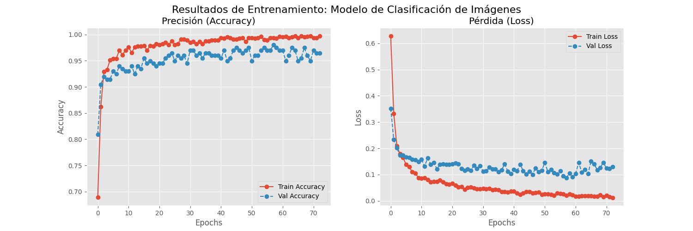
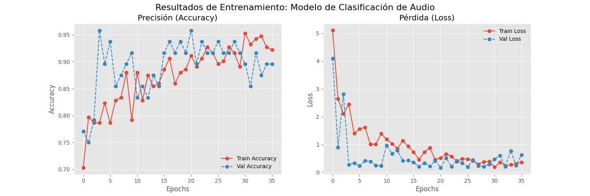

# Train-Model

Sistema de entrenamiento modular diseñado bajo principios SOLID y arquitectura en capas (DDD). Este módulo se encarga de la descarga de datasets, preprocesamiento de datos y el entrenamiento de redes neuronales para visión (MobileNetV2) y audio (MLP sobre MFCCs).

## 1. Arquitectura del Proyecto

El código ha sido refactorizado para separar la infraestructura de datos de la lógica de entrenamiento y la definición de modelos.

```text
train-model/
├── src/
│   ├── application/           # Gestor del ciclo de entrenamiento (TrainerEngine)
│   ├── domain/                # Fabrica de Modelos (MobileNetV2, Audio MLP)
│   ├── infrastructure/        # DataLoaders y Downloader
│   └── config.py              # Hiperparametros y rutas
├── setup_data.py              # Script de preparacion de datos
└── run_training.py            # Script de ejecucion principal
data/
├── checkpoints/           # Pesos guardados (.h5)
└── logs/                  # Historial de entrenamiento (.csv)
dataset/                   # Datos crudos (descargados automaticamente)
```

## 2. Entorno de Ejecucion

Requiere el mismo entorno `fuego_gpu` configurado para el servidor.

```bash
conda activate fuego_gpu
```

## 3. Origen de Datos (Datasets)

El sistema descarga y estructura automáticamente los siguientes conjuntos de datos:

### Vision

- **Dataset:** Fire Dataset
- **Fuente:** Kaggle (phylake1337)
- **Enlace:** [https://www.kaggle.com/datasets/phylake1337/fire-dataset](https://www.kaggle.com/datasets/phylake1337/fire-dataset)
- **Estructura:** Imagenes clasificadas en carpetas `fire_images` y `non_fire_images`.

### Audio

- **Dataset:** ESC-50 (Environmental Sound Classification)
- **Fuente:** GitHub (karolpiczak)
- **Enlace:** [https://github.com/karolpiczak/ESC-50](https://github.com/karolpiczak/ESC-50)
- **Preprocesamiento:** Se filtran unicamente las categorias `crackling_fire` (clase positiva) y sonidos ambientales como lluvia, viento y grillos (clase negativa).

## 4. Arquitectura de los Modelos

### Modelo de Vision

Implementa Transfer Learning utilizando una red preentrenada como base.

- **Base:** MobileNetV2 (pesos ImageNet, capas congeladas).
- **Head (Entrenable):**
- GlobalAveragePooling2D
- Dense (128 neuronas, ReLU)
- Dropout (0.5)
- Salida: Dense (1 neurona, Sigmoid)

### Modelo de Audio

Red neuronal densa (Feed Forward) optimizada para características espectrales.

- **Entrada:** 40 caracteristicas MFCC (Mel-frequency cepstral coefficients).
- **Capas Ocultas:**
- Dense (256 neuronas, ReLU)
- Dropout (0.3)
- Dense (128 neuronas, ReLU)

- **Salida:** Dense (1 neurona, Sigmoid)

## 5. Ejecucion del Entrenamiento

El proceso se divide en dos etapas: preparación de datos y entrenamiento.

### Paso 1: Preparacion de Datos

Este script descarga los zips, extrae el contenido, organiza las carpetas en `dataset/` y limpia los archivos temporales.

```bash
python setup_data.py

```

**Salida esperada:**

```text
Procesando Audio (ESC-50)...
Audio listo.
Procesando Vision (Fire Dataset)...
Vision lista.
Setup Finalizado.

```

### Paso 2: Iniciar Entrenamiento

Este script carga los DataLoaders, construye los modelos mediante la Factory y ejecuta el ciclo de entrenamiento. Los mejores modelos se guardan automáticamente en `data/checkpoints`.

```bash
python run_training.py

```

**Salida esperada:**

```text
=== SISTEMA DE ENTRENAMIENTO MODULAR (SOLID) ===

--- Iniciando Modulo de Vision ---
Found 755 images belonging to 2 classes.
Found 188 images belonging to 2 classes.
Epoch 1/100

--- Iniciando Modulo de Audio ---
Procesando audios: 40 Fuego | 200 Normal
Epoch 1/150

Entrenamiento finalizado. Modelo guardado en: data/checkpoints/audio/final_model.h5
```

## 6. Resultados y GraficasLos registros de entrenamiento (Accuracy y Loss) se almacenan en `data/logs/` en formato txt.

1. **Curvas de Entrenamiento - Vision:**

   

2. **Curvas de Entrenamiento - Audio:**

   

## Author

- **Braulio Nayap Maldonado Casilla** - [GitHub Profile](https://github.com/ShinjiMC)
- **Sergio Daniel Mogollon Caceres** - [GitHub Profile](https://github.com/i-am-sergio)
- **Paul Antony Parizaca Mozo** - [GitHub Profile](https://github.com/PaulParizacaMozo)
- **Avelino Lupo Condori** - [GitHub Profile](https://github.com/lino62U)
- **Leon Felipe Davis Coropuna** - [GitHub Profile](https://github.com/LeonDavisCoropuna)
- **Aldo Raul Martinez Choque** - [GitHub Profile](https://github.com/ALdoMartineCh16)
